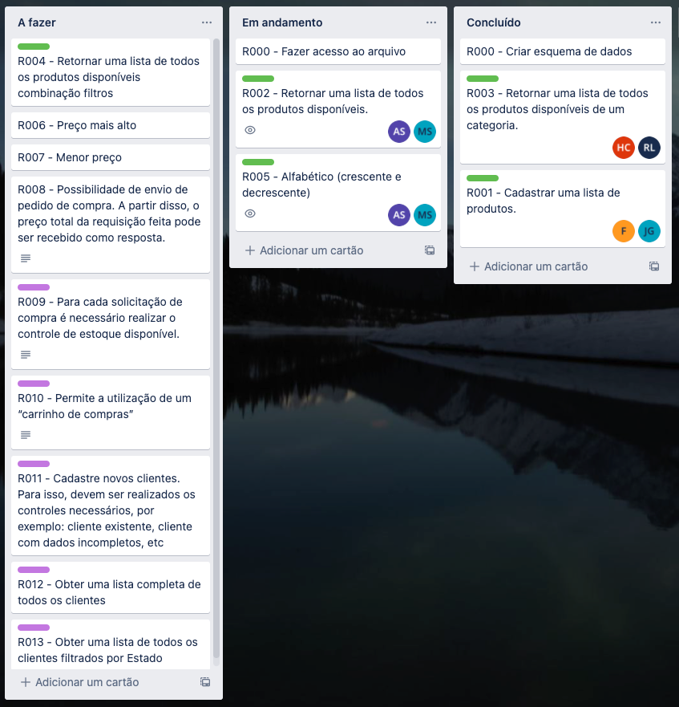

# Desafio Spring - Grupo 4
### Wave 5 - Bootcamp Backend Java - Mercadolive

O objetivo deste sprint é aplicar os conteúdos fornecidos até o momento durante o
BOOTCAMP MeLi (Git, Java e Spring), para poder implementar uma API REST a partir de uma
declaração proposta, uma especificação de requisitos e documentação anexada.

O desafio proposto abaixo consiste em 2 partes:
A. Desenvolva uma API para um determinado cenário. No ponto A da seção
seguinte há uma descrição detalhada do cenário e de cada um dos requisitos
solicitados.
B. Bônus. Caso todos os requisitos estabelecidos no ponto A sejam cumpridos e ainda
haja tempo, esta atividade pode ser realizada, que apresenta um nível de
complexidade maior.

## Organização do grupo
Separamos todos os requistos da aplicação em tasks. Com o auxílio do Trello, organizamos quais integrantes ficaram responsáveis por cada uma das tarefas - podendo inclusive realizar o trabalho em duplas ou trios quando necessário.

## Sobre o desenvolvimento da aplicação

> Essa parte está em desenvolvimento - assim que concluído o desafio compartilharemos detalhes do funcionamento da nossa solução assim como um guia de como executa-la.